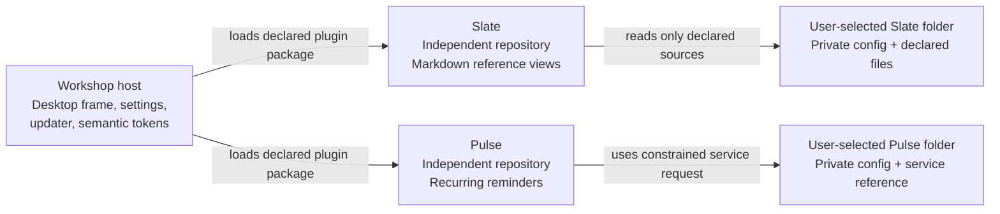
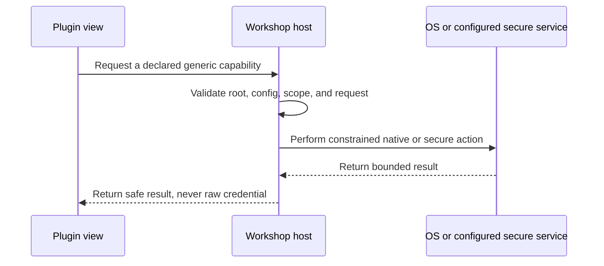

The first version of a small tool is rarely the hard part.

The hard part is what happens after it works. It needs a sensible place to launch. It needs private inputs that stay private. It needs an update path. It needs enough structure that the next tool does not turn the first one into an archaeological site.

I built **Workshop** to solve that problem for the small, local-first apps I actually use. It is a macOS host, not a giant product suite. It gives independent tools a shared frame while leaving each tool in charge of its own UI, domain logic, tests, documentation, and release history.

This post is the technical anatomy of that decision. The interesting part is not that I made a desktop shell. Plenty of people can make a window. The interesting part is drawing boundaries that still hold when an app needs local files, a credentialed service, a theme, an external link, or a new release.

## The tempting architecture was one giant app

The obvious early move was to put every useful workflow into one repository and one application. One navigation system, one set of components, one deployment path. It would have been fast right up until it was not.

That architecture has a predictable failure mode. A Markdown reference viewer starts sharing assumptions with a reminder system. A tiny UI change becomes a regression risk for unrelated tools. Private data conventions leak across feature boundaries because the application has stopped distinguishing products from tabs.

The alternative was a small host with a deliberately narrow job:

- Workshop owns the macOS frame, app shelf, local preferences, native menus, updates, and shared visual tokens.
- Each tool owns its own repository, package, routes, product logic, tests, and documentation.
- Each person keeps real inputs, configuration, credentials, and runtime state in local folders outside the public repositories.

That last line is architectural, not decorative. If a tool is useful because it works with private material, the privacy boundary cannot be a paragraph at the bottom of a README. It has to survive the code paths.



The consequence is useful: Workshop can become a better shell without becoming the accidental owner of every product decision inside it.

## The plugin contract is intentionally boring

The core integration point is a data-first plugin declaration plus a React view. A tool does not hand Workshop a grab bag of native permissions or ask it to understand the tool's domain model. It describes what it is, which routes it owns, and which generic host capabilities it needs.

Here is the simplified shape:

```ts
export const workshopPluginDeclaration = {
  contractVersion: 1,
  id: "example-tool",
  displayName: "Example Tool",
  routes: [
    { id: "home", label: "Home", path: "/example-tool/home" },
  ],
  status: "ready",
  requiredLocalCapabilities: ["local-workspace"],
  runtime: {
    kind: "native-bridge",
    entryPoint: "generic-capability-name",
  },
} as const;

export function WorkshopToolView(props: ToolViewProps) {
  return <ExampleTool {...props} />;
}
```

The important word is `generic`. Workshop knows how to validate and fulfill a small set of capabilities. It does *not* know that Slate has a document called “UC,” that Pulse has a reminder called “Take out the trash,” or how either app parses its data.

That rule prevents the shell from accumulating app-specific conditionals. If adding a third tool requires adding another `if (tool === "slate")` block in Workshop, the contract is already telling on itself.

The declaration also makes promotion explicit. A tool stays `planned` until its owner decides it is actually ready. Workshop can hide incomplete work rather than displaying a shelf full of theoretical software, which is one of the less charming genres of software.

## Capabilities are the real boundary

Plugins need to do things. The usual lazy answer is broad filesystem access, an environment variable, or a token pushed into the webview. All three are great ways to make a private tool less private.

Workshop instead exposes narrow host commands. The host validates a request, performs the native or credentialed action, and returns the smallest useful result.

For Slate, the host can read metadata for Markdown sources declared in the user's private `slate.config.json`, read one declared source by ID, and watch only those declared files. Slate never receives a recursive file browser or a “find anything that looks relevant” button.

```json
{
  "version": 1,
  "sources": [
    {
      "id": "reference-notes",
      "label": "Reference notes",
      "path": "/absolute/path/to/reference-notes.md",
      "view": "markdown-tabs"
    }
  ]
}
```

The path above is a placeholder. In the actual system, it lives only in the user's local configuration. When Slate asks which sources exist, Workshop returns the display-safe fields, such as `id`, `label`, and `view`, not the path. When Slate asks to read a source, the host validates that it was declared first.

For Pulse, the shape is different because the tool talks to a private authenticated service. It can read non-secret connection metadata and request a constrained `/api/` operation. The host retrieves the credential from the macOS Keychain internally. Pulse never receives the bearer token, cannot choose an arbitrary origin, and cannot attach its own authorization header.



This is less convenient than passing a token around. Good. Convenience is not the only axis that exists.

The same pattern applies to smaller seams. A plugin can ask Workshop to open a validated `https`, `http`, or `mailto` URL through the operating system. It cannot smuggle a Tauri dependency into its own package, and a desktop webview cannot quietly turn `target="_blank"` into a dead end.

## Private folders are selected, not discovered

Workshop remembers a user-selected tool folder locally. It lets the user review, reconnect, change, or forget that path from Preferences. What it does not do is crawl the disk, create a pile of mystery configuration, move source files around, or delete something when a tool is disconnected.

That decision produces a less magical first-run experience. The user has to choose the folder. The folder has to contain the app's expected private configuration. A malformed config makes the affected tool unavailable until it is corrected.

That is an acceptable trade. The alternative is a desktop app that “helps” by inferring where sensitive information probably lives. I do not want that app on my machine, and I would not recommend it to anyone else.

It also keeps ownership legible:

| Concern | Owner |
| --- | --- |
| Tool source code, UI, parser, and docs | The tool repository |
| Local product data, credentials, config, and generated output | The user's private folder and Keychain |
| Desktop shell, folder lifecycle, capability enforcement, and updates | Workshop |

The table looks banal because good boundaries often do. The implementation is where the work lives.

## Shared appearance without a forced rewrite

Once Workshop had more than one app, a shared palette became useful. The trap was making every plugin adopt a Workshop theme API or store a copy of the user's preference. That would recreate the coupling the plugin boundary was built to avoid.

Instead, Workshop publishes semantic CSS custom properties on the host document. Plugins consume them with their own fallback values.

```css
/* Workshop supplies these when the app is embedded. */
:root {
  --workshop-canvas: #071116;
  --workshop-surface: #0d1d24;
  --workshop-accent: #2bb7e8;
  --workshop-focus-ring: #62e6bd;
}

/* Slate stays coherent when Workshop is absent. */
.slate-plugin {
  --slate-canvas: var(--workshop-canvas, #070708);
  --slate-surface: var(--workshop-surface, #101013);
  --slate-accent: var(--workshop-accent, #ff1b8d);
}
```

This is progressive enhancement, not dependency injection in a trench coat. When Workshop changes its active palette, an embedded plugin inherits the semantic values immediately. When the plugin runs alone, its own fallback treatment remains intact. Neither Slate nor Pulse needs to recognize a host palette name, import Workshop source, or persist the preference.

The distinction matters because themes are not just a paint bucket. They touch focus states, error states, contrast, buttons, selected controls, and the visual relationship between the host and its tools. Shared tokens give the system a consistent vocabulary. Scoped plugin CSS stops one app from redecorating the rest of the building.

## The unglamorous parts are the product work

The architecture looks cleanest in a diagram. The work that makes it usable is mostly the stuff diagrams omit:

- Native menu commands need to reach the webview correctly, including ordinary things such as `Command-C`.
- Update checks need to work on launch and while the app stays open, then surface a useful state instead of a cryptic status label.
- Private-folder failures must isolate the affected tool, not prevent the rest of Workshop from loading.
- A release needs a pinned app revision, a reproducible build, and an updater artifact that can be verified by the installed application.
- An app that has not yet adopted shared theme tokens still needs to work normally.

None of this is glamorous. It is also the difference between a prototype and a tool someone can trust with a Tuesday.

The test strategy follows the boundary lines rather than pretending one end-to-end test can do the whole job. Workshop tests pure models for persistence, validation, scheduling, palette selection, and corrupt-state recovery. It tests mounted UI workflows for preferences, folder changes, keyboard and focus behavior, and app availability. It tests the native host contracts for unsafe paths, unsafe URLs, constrained service requests, and credential redaction. Plugins test their own parsing, presentation, standalone fallbacks, and inherited-token behavior.

The point is not to declare victory because a coverage number looks handsome in a badge. The point is to put regression tests where the system could break a promise: private data stays local, a plugin does not get a broader capability than it declared, and a preference does not make an independent tool stop working.

## Independence has a cost

This model is not free.

When Slate or Pulse ships a new plugin revision, Workshop pins that exact revision and publishes a new host release. That adds a deliberate review step. It means the installed product is a known combination of shell and tool code, rather than whatever happened to be latest when the app launched.

The current public installation path also expects a macOS developer environment. That is honest but not ideal. A signed, notarized installer is the next distribution problem to solve before I describe Workshop as a broad public product. Source availability is not the same thing as a good product path, no matter how energetically a README tries to cosplay as one.

Those limitations are part of the architecture, too. A credible technical explanation includes the tradeoffs and the unfinished edges. Otherwise it is just product copy with a code fence.

## Why this matters beyond one tiny desktop app

Workshop is small, but the design problem is common. Teams build internal tools, developer utilities, customer-facing extensions, and AI-assisted workflows that each need some combination of shared conventions and strict ownership boundaries.

The useful questions are not “should we build a platform?” or “can we make it plug-in based?” Those are usually invitations to overbuild.

The questions worth answering are more specific:

- What does the host own that every app genuinely needs?
- What must remain an app-level decision?
- Which capability can be made generic without becoming dangerously broad?
- Where does private data live, and which code paths can prove it stayed there?
- How does an app improve without forcing every sibling app to ship in lockstep?

That is product architecture. It is also technical storytelling. The useful story is not that a system has boxes and arrows. It is that the boxes represent real ownership, and the arrows have constraints.

## Try Workshop

Workshop is available from source today. If you build small tools that need a more durable home without being absorbed into one giant application, [try Workshop on GitHub](https://github.com/LindsayB610/workshop).

I will write separately about Slate and Pulse, because their product decisions deserve more than a drive-by paragraph. For now, Workshop is the frame: a small host that lets focused tools remain focused, private data remain private, and the whole system stay explainable after the first useful version.
